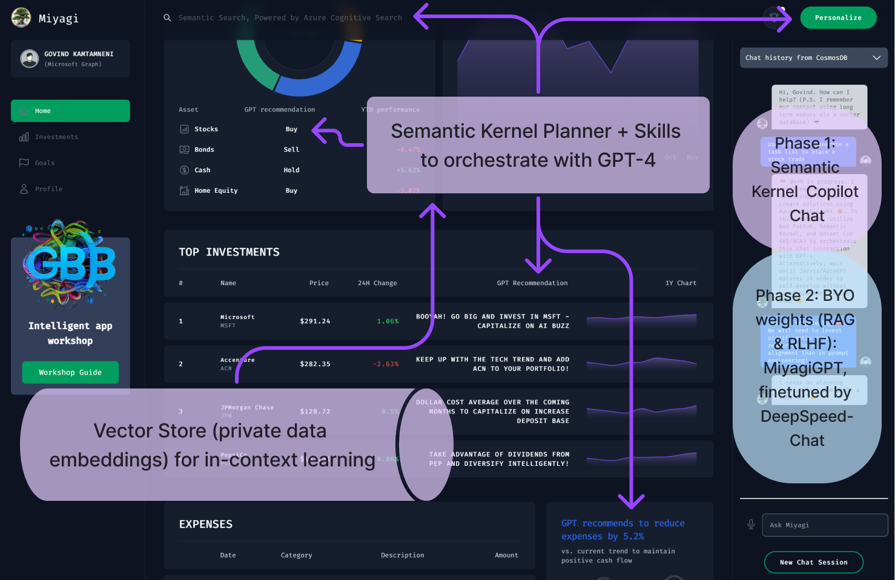

# Home

We are undoubtedly experiencing one of the most significant technological transformations in the history of humanity. However, AI alone isn't the future. It is people who harness its capabilities to amplify their impact that will shape the future. This also extends to software systems: systems with intelligence will outperform those without. Our workshop, using [Microsoft's Copilot stack](https://news.microsoft.com/source/features/ai/microsoft-outlines-framework-for-building-ai-apps-and-copilots-expands-ai-plugin-ecosystem/), is designed to help you envision and create these cutting-edge, intelligent systems. These systems integrate foundation models throughout the entire lifecycle of your application—from user experience to design, development, and deployment—and promote positive-sum outcomes for all stakeholders.

[Sign up for updates](https://forms.office.com/r/rLds2s8RH1){ :target="_blank" .md-button .md-button--primary }

!!! note ""

    For a preview, catch the [recording on :simple-youtube: Cosmos DB Live TV](https://www.youtube.com/watch?v=V8dlEvXdGEM&t=144s)
    

 

By leveraging design thinking, [Project Miyagi](https://github.com/Azure-Samples/miyagi), and art-of-the-possible examples (with samples and skills from [Semantic Kernel (SK)](https://github.com/microsoft/semantic-kernel), [Miyagi](https://github.com/Azure-Samples/miyagi), and [Reddog](https://github.com/Azure/reddog-solutions)), this workshop offers a comprehensive, hands-on exploration of how large, pre-trained foundation models can augment your applications with intelligence to create hyper-personalized product experiences and boost productivity. You will acquire skills to effectively curate and create value-driven workflows to serve your use cases with the capabilities of foundation models. We will also have an Architecture Design Session (ADS) to unlock and operationalize the full potential of AI-infused applications for your organization.

## Topics for the workshop

???+ info "Pre-requisite"

    Please signup for [Azure OpenAI (AOAI)](https://aka.ms/oai/access) and complete [Getting started with AOAI module](https://learn.microsoft.com/en-us/training/modules/get-started-openai/) to benefit from this workshop

1. Exploring the Art of the Possible with [Miyagi](https://github.com/Azure-Samples/miyagi) and [Semantic Kernel (SK)](https://github.com/microsoft/semantic-kernel) demos: Engage in interactive demonstrations to envision the potential applications of SK and [Miyagi](https://github.com/Azure-Samples/miyagi).
1. Design Thinking Session: A collaborative brainstorming activity to identify your idiosyncratic use cases, focusing on addressing user needs and alleviating pain points, so that the workshop will be relevant for you.
1. Introduction to Semantic Kernel (SK): A comprehensive presentation to familiarize participants with the fundamentals of SK and goals-first AI.
1. End-to-End Application Lifecycle Workshop featuring [Miyagi](https://github.com/Azure-Samples/miyagi): Gain hands-on experience in incorporating SK primitives into the entire application lifecycle, including leveraging SK skills and prompt engineering to orchestrate complex flows with Azure OpenAI models. 

1. Architecture Design Session: Dive into the intricacies of designing a robust and effective system architecture to support intelligent app development.

[See full-agenda](wksp/00-intro/agenda-and-outcomes.md){ .md-button }
