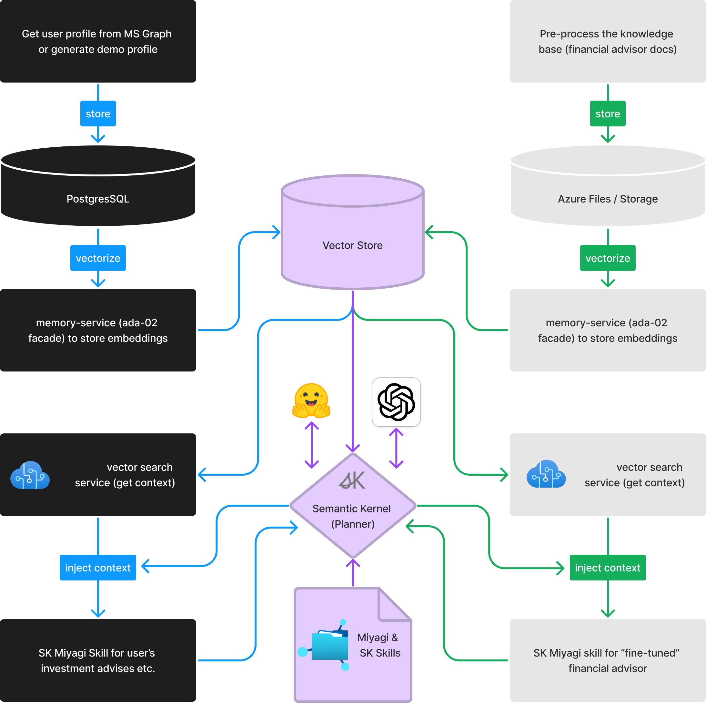
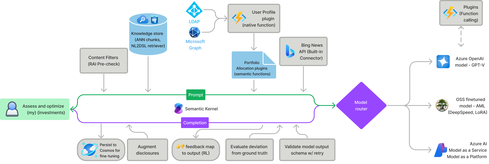

# Architecture

Polyglot, AI-Infused Microservices Architecture with Event-Driven Backend

[Sign up for updates](https://forms.office.com/r/rLds2s8RH1){ :target="_blank" .md-button .md-button--primary }

### Copilot Stack

## Overview

Project Miyagi presents a modern, event-driven architecture, incorporating AI-infused microservices to enable seamless integration of state-of-the-art (SoTA) foundation models in user experiences and backend workflows. Built on Azure primitives and orchestrated by Semantic Kernel, the architecture emphasizes scalability, flexibility, and adaptability, paving the way for nascent, AI-enabled intelligent app design.

Miyagi's architecture is designed with a focus on customer-centricity, leveraging AI capabilities to create and curate hyper-personalized user interactions. By employing Semantic Kernel skills and advanced prompt engineering techniques, Miyagi goes beyond a simple chat interface to transform both line-of-business and consumer-facing applications. It features a diverse range of microservices, utilizing retail and high-frequency trading, along with generative text and images for tailored financial coaching, summarization, and agent-like orchestration.

The event-driven backbone of Miyagi's architecture ensures enterprise-grade quality attributes such as availability, scalability, and maintainability. The architecture is designed to evolve with the rapid advancements in foundation models, allowing for incremental implementation of various use cases and experimentation.

Miyagi's frontend moves beyond simple chat interactions, offering a more engaging and personalized user experience. This is similar to how Microsoft Copilots deliver product experiences. In addition, with Reddog sample, we will explore how generative image use case with [Dreambooth](https://huggingface.co/thegovind/reddogpillmodel512) could be adopted for personalized image generation (personalized medicine, in this example).

By incorporating cutting-edge technologies and frameworks such as Semantic Kernel, Prompt Flow, TypeChat, Guidance, Miyagi demonstrates how developers can harness the power of AI to build the next generation of intelligent applications. By leveraging these tools and technologies, Miyagi serves as a blueprint for creating applications that adapt and grow alongside their users, providing highly personalized and contextually relevant experiences.

To ensure seamless integration and communication between the various components of Miyagi's architecture, a combination of Azure Functions, AKS/ACA, and Apache Kafka on Azure Event Hubs is used. These technologies facilitate efficient management of microservices, data storage, and real-time processing of events, allowing the system to scale according to the needs of the application.

Data storage and retrieval are handled by a combination of Cosmos DB, Azure DB for PostgreSQL, Azure Redis Cache, and Azure Storage, ensuring high performance and reliability. Azure Monitor is employed for tracking and managing the performance of the deployed services, providing insights into the system's health and enabling proactive maintenance.

The entire development and deployment pipeline is streamlined using GitHub Actions, ensuring a smooth and efficient development process, from code updates to production releases.

In summary, Project Miyagi's architecture presents a forward-looking approach to building intelligent applications, leveraging advanced AI techniques and robust Azure services to create highly engaging, personalized user experiences. By incorporating cutting-edge technologies and embracing event-driven, scalable microservices, Miyagi offers developers a glimpse into the future of application design and development.

### Orchestration flow

### LLM Round-trip

## Tech Stack

### Services and Features
- [Azure OpenAI](https://learn.microsoft.com/en-us/azure/cognitive-services/openai/concepts/models)
  - gpt-4
  - gpt-35-turbo
  - text-embedding-ada-002
- [Semantic Kernel](https://github.com/microsoft/semantic-kernel)
- [Use your own data with Azure OpenAI](https://learn.microsoft.com/en-us/azure/ai-services/openai/use-your-data-quickstart?tabs=command-line&pivots=rest-api#example-curl-commands)
- [AzureML PromptFlow](https://learn.microsoft.com/en-us/azure/machine-learning/prompt-flow/overview-what-is-prompt-flow?view=azureml-api-2)
- [TypeChat](https://microsoft.github.io/TypeChat)
- [Azure Functions](https://azure.microsoft.com/en-ca/products/functions/)
- [APIM](https://learn.microsoft.com/en-us/azure/api-management/)
- [Service Bus](https://learn.microsoft.com/en-us/azure/service-bus-messaging/service-bus-messaging-overview)
- [Event Grid](https://learn.microsoft.com/en-us/azure/event-grid/overview)
- [Logic Apps](https://learn.microsoft.com/en-us/azure/logic-apps/overview)
- [AKS](https://azure.microsoft.com/en-us/products/kubernetes-service) / [ACA](https://azure.microsoft.com/en-us/products/container-apps)
- [Cosmos DB](https://azure.microsoft.com/en-us/products/cosmos-db/)
- [Github Actions](https://docs.github.com/en/actions)
- [Azure Monitor](https://learn.microsoft.com/en-us/azure/azure-monitor/)
- [Azure DB for PostgreSQL](https://azure.microsoft.com/en-us/products/postgresql)
- [Azure Redis Cache](https://azure.microsoft.com/en-us/products/cache)
- [Azure Storage](https://learn.microsoft.com/en-us/azure/storage/common/storage-introduction)
- [Apache Kafka on Azure Event Hubs](https://learn.microsoft.com/en-us/azure/event-hubs/azure-event-hubs-kafka-overview)
- [Azure HuggingFace Inference Endpoints](https://azure.microsoft.com/en-us/solutions/hugging-face-on-azure)
- [LangChain](https://github.com/hwchase17/langchain#readme)
- [Foundation Models from CogServices](https://azure.microsoft.com/en-us/blog/announcing-a-renaissance-in-computer-vision-ai-with-microsofts-florence-foundation-model/)
- [Qdrant](https://qdrant.tech/solutions/)
- [Microsoft DeepSpeed Chat](https://github.com/microsoft/DeepSpeedExamples/tree/master/applications/DeepSpeed-Chat)
- [Azure Web PubSub](https://azure.microsoft.com/en-us/products/web-pubsub)
- [Azure Communication Services (ACS)](https://learn.microsoft.com/en-us/azure/communication-services/overview#common-scenarios)
