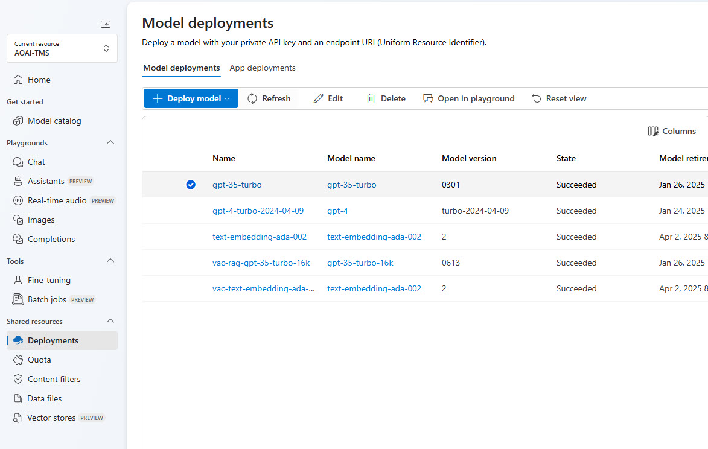

# Prerequisites

!!! note "Mandatory pre-requisite"

    Please signup for [Azure OpenAI (AOAI)](https://aka.ms/oai/access) and complete [Getting started with AOAI module](https://learn.microsoft.com/en-us/training/modules/get-started-openai/)

Before attending the Intelligent App Development Workshop, please ensure you have the following prerequisites in place:

1. **Basic programming knowledge**: Familiarity with at least one programming language (e.g., Python, JavaScript, Java, or C#) and basic understanding of software development concepts.
1. **Azure account**: A Microsoft Azure account with an active subscription. If you don't have one, sign up for a [free trial](https://azure.microsoft.com/en-us/free/).
1. **Azure subscription with access enabled for the Azure OpenAI Service** - For more details, see the [Azure OpenAI Service documentation on how to get access](https://learn.microsoft.com/azure/ai-services/openai/overview#how-do-i-get-access-to-azure-openai). 
1. **Azure OpenAI resource** - For this workshop, you'll need to deploy at least one model such as GPT 4. See the Azure OpenAI Service documentation for more details on [deploying models](https://learn.microsoft.com/azure/ai-services/openai/how-to/create-resource?pivots=web-portal) and [model availability](https://learn.microsoft.com/azure/ai-services/openai/concepts/models).
1. **Development environment**: A computer with your preferred development environment installed, such as Visual Studio Code, PyCharm, or another IDE that supports the programming language you'll be using in the workshop.
1. **Git**: Familiarity with Git and GitHub for version control. Ensure you have [Git](https://git-scm.com/book/en/v2/Getting-Started-Installing-Git) installed on your computer.
1. **.NET CLI**: .NET CLI is included when you install [.NET SDK](https://dotnet.microsoft.com/en-us/download)

## Initial Setup

### 1. Ensure all [pre-requisites](pre-reqs.md) are met and installed.
### 2. Clone this repo using: 

    ```bash
    git clone https://github.com/Azure/intelligent-app-workshop.git
    ```

### 3. Change directory into cloned repo:

    ```bash
    cd intelligent-app-workshop
    ```

### 4. Copy and rename the file `appsettings.json.example` into the corresponding lesson directory as follows (example command for Lesson1):

    ```bash
    cp workshop\dotnet\Lessons\appsettings.json.example workshop\dotnet\Lessons\Lesson1\appsettings.json
    ```

### 5. Retrieve the OpenAI Endpoint URL, API Key and deployed model name then update newly created appsettings.json

#### 5.1 Get Azure OpenAI access values: From Portal

The Azure OpenAI endpoint and key values will be found in the [Azure Portal](https://portal.azure.com) so let's start there.

1. Go to the [Azure Portal](https://portal.azure.com).
1. Go to the Azure OpenAI resource.
1. Expand the **Resource Management** section in the sidebar (menu at left)
1. Click the **Keys and Endpoint** option.
1. Click **Show Keys** - you should see the following: KEY 1, KEY 2 and Endpoint.
1. Use the **KEY 1** value for **apiKey** in appsettings.json under OpenAI.
1. Use the **Endpoint** value for **endpoint** in appsettings.json under OpenAI.


Next, we need to create deployments from the Azure OpenAI models.

1. Click the **Model deployments** option in the sidebar (left menu) for Azure OpenAI resource.
1. In the destination page, click **Manage Deployments**
1. (Optional) You can directly navigate to the [Azure OpenAI Studio website](https://oai.azure.com).

This will take you to the Azure OpenAI Studio website, where we'll find the other values as described below.

#### 5.2 Get Azure OpenAI deployments: From Studio

1. Navigate to [Azure OpenAI Studio](https://oai.azure.com) **from your resource** as described above.
2. Click the **Deployments** tab (sidebar, left) to view currently deployed models.
3. If your desired model is not deployed, use **Create new deployment** to deploy it. If using the new portal, use **Deploy model** button.
4. You will need a chat completion model (gpt-35-turbo model or similar)- deploy the model
5. Update appsettings.json deploymentName field with your model deployment name.




??? note "Optional"
    The following prerequisites are optional but recommended to get the most out of the workshop:
    
    1. **Azure CLI**: Install the [Azure Command-Line Interface (CLI)](https://docs.microsoft.com/en-us/cli/azure/install-azure-cli) to interact with Azure services and manage resources from the command line.

    1. **Azure Functions Core Tools**: Install the [Azure Functions Core Tools](https://docs.microsoft.com/en-us/azure/azure-functions/functions-run-local?tabs=windows%2Ccsharp%2Cbash#v2) to create, test, and deploy Azure Functions from your local development environment.
    
    1. **Docker**: Install [Docker Desktop](https://www.docker.com/products/docker-desktop) to build and run containerized applications.
    
    1. **Cognitive Services SDKs**: Install the SDKs for the Azure Cognitive Services you'll be using in the workshop, such as the [Azure OpenAI SDK](https://pypi.org/project/azure-cognitiveservices-openai/), based on your programming language and the services used during the workshop.

By ensuring you have completed these prerequisites, you'll be well-prepared to dive into the Intelligent App Development Workshop and make the most of the hands-on learning experience.
