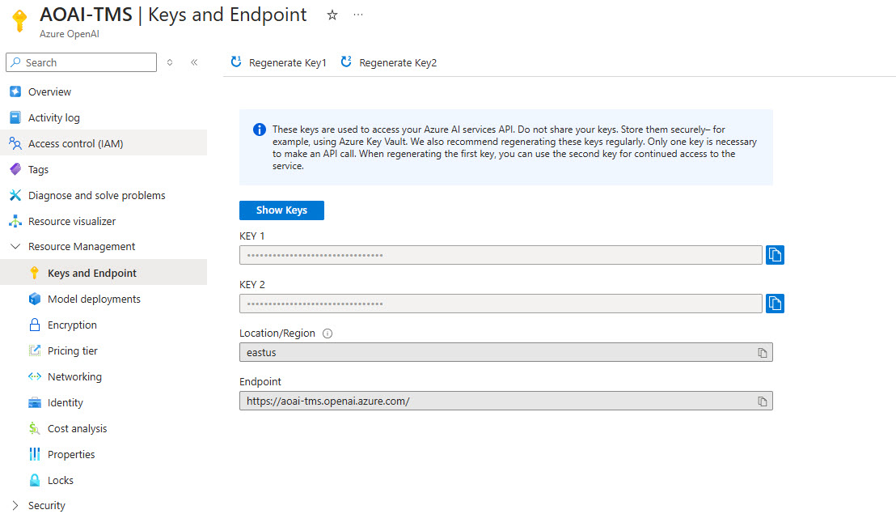
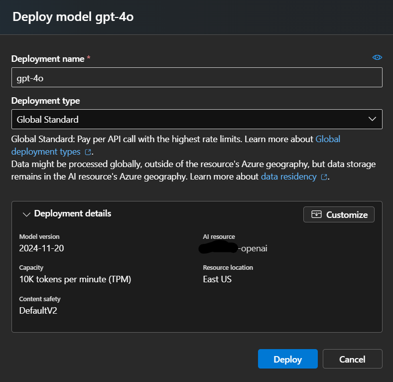
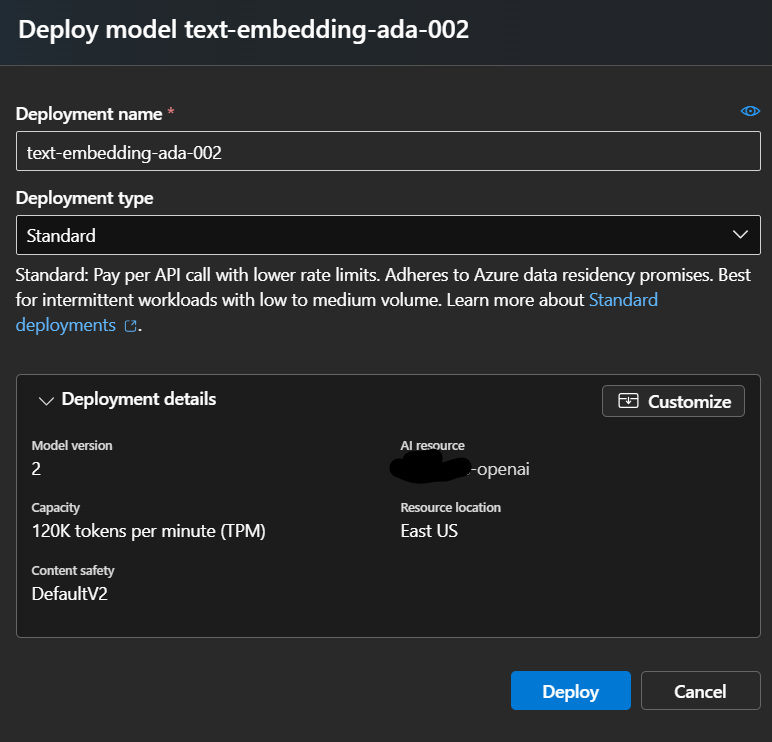

# Prerequisites

Before attending the Intelligent App Development Workshop, please ensure you have the following prerequisites in place:

1. **Azure account**: A Microsoft Azure account with an active subscription. If you don't have one, sign up for a [free trial](https://azure.microsoft.com/en-us/free/).
1. **Azure subscription with access enabled for the Azure OpenAI Service** - For more details, see the [Azure OpenAI Service documentation on how to get access](https://learn.microsoft.com/azure/ai-services/openai/overview#how-do-i-get-access-to-azure-openai). 
1. **Azure OpenAI resource** - For this workshop, you'll need to deploy at least one model such as GPT 4. See the Azure OpenAI Service documentation for more details on [deploying models](https://learn.microsoft.com/azure/ai-services/openai/how-to/create-resource?pivots=web-portal) and [model availability](https://learn.microsoft.com/azure/ai-services/openai/concepts/models).

## Development Environment Setup

You have the option of using [Github Codespaces](https://docs.github.com/en/codespaces/getting-started/quickstart) or your local development environment.

### Using Github Codespaces (recommmended)

If using Github Codespaces all prerequisites will be pre-installed, however you will need to create a fork as follows:

1. Navigate to this link to create a new [fork](https://github.com/Azure/intelligent-app-workshop/fork) (must be logged into your github account).
1. Accept the default values and click on **"Create fork"** which will take you to the forked repository in the browser.
1. From your forked repository click on the **"<> Code"** button. Then click on the **"Create codespace on main"** button.

### Using local development environment

If you prefer using a computer with using a local development environment, the following pre-requisites need to be installed:

1. **Git**: Ensure you have [Git](https://git-scm.com/downloads) installed on your computer.
1. **Azure CLI**: Install the [Azure Command-Line Interface (CLI)](https://docs.microsoft.com/en-us/cli/azure/install-azure-cli) to interact with Azure services and manage resources from the command line.
1. **.NET SDK**: install [.NET SDK](https://dotnet.microsoft.com/en-us/download) to build and run .NET projects.
1. **Docker**: Install [Docker Desktop](https://www.docker.com/products/docker-desktop) to build and run containerized applications.
1. **Node.Js**: Install [Node.Js](https://nodejs.org/en/download/package-manager) to build and run web application.
1. **Azure Development CLI**: Install [azd](https://learn.microsoft.com/en-us/azure/developer/azure-developer-cli/install-azd) to be able to provision and deploy application to Azure.
1. **bash/shell terminal**: the lessons assume bash/shell script syntax. If using Windows, either you can either using Git Bash (included when you install Git) or installing [WSL (Windows Subsystem for Linux)](https://learn.microsoft.com/en-us/windows/wsl/install).

Next you will need to clone this repo using:

```bash
git clone https://github.com/Azure/intelligent-app-workshop.git
```

Change directory into cloned repo:

```bash
cd intelligent-app-workshop
```

## Initial Setup

1. Copy and rename the file `appsettings.json.example` into the corresponding lesson directory as follows (example command for Lesson1):

    ```bash
    cp workshop/dotnet/Lessons/appsettings.json.example workshop/dotnet/Lessons/Lesson1/appsettings.json
    ```

1. Create Azure OpenAI Service and retrieve the Endpoint URL, API Key and deployed model name then update newly created `appsettings.json`

    1. Get Azure OpenAI access values (from Azure Portal):
        1. First we need to create a new Azure OpenAI Service, so let's start there. Go to the [Azure Portal](https://portal.azure.com).
        1. Click on [Create A Resource](https://ms.portal.azure.com/#create/hub)
        1. On the search bar type **Azure OpenAI** and hit enter
        1. Locate **Azure OpenAI** and click **Create**
        1. On the **Create Azure OpenAI** page, provide the following information for the fields on the Basics tab:
            * Subscription: The Azure subscription to used for your service.
            * Resource group: The Azure resource group to contain your Azure OpenAI service resource. You can create a new group or use a pre-existing group.
            * Region: The location of your instance. Different locations can introduce latency, but they don't affect the runtime availability of your resource.
            * Name: A descriptive and unique name for your Azure AI Service resource, such as `aoai-intelligent-app-workshop-myid`.
            * Pricing Tier: The pricing tier for the resource. Currently, only the `Standard S0` tier is available for the Azure AI Service.
            * Check the box to acknowledge that you have read and understood all the Responsible AI notices.
        1. Click **Next**.
        1. Review default **Network** values and click **Next**
        1. On the **Tags** tab click **Next**
        1. Click **Create**.
        1. From the deployment page, wait for the deployment to complete and then click **Go to resource**
        1. Expand the **Resource Management** section in the sidebar (menu at left)
        1. Click the **Keys and Endpoint** option - you should see the following: KEY 1, KEY 2 and Endpoint.
        1. Copy the **KEY 1** value and paste it into the **apiKey** value within the `OpenAI` element in the `appsettings.json` file.
        1. Copy the **Endpoint** value and paste it as the **endpoint** value within the `OpenAI` element in the `appsettings.json` file.

            

        Next, we need to create deployments from the Azure OpenAI models.

        1. Click the **Overview** option in the sidebar (left menu) for the Azure OpenAI resource.
        1. Click on **Explore Azure AI Foundry portal** button. Click continue to leave Azure Portal when prompted.
        1. Alternatively, you can directly navigate to the [Azure AI Foundry portal](https://ai.azure.com).

        This will take you to the Azure AI Foundry website, where we'll find the other values as described below.

    1. Deploy Azure OpenAI model (from Azure AI Foundry):

        1. Navigate to [Azure AI Foundry](https://ai.azure.com) **from your resource** as described above.
        1. Click on **Deployments** (sidebar, left within **Shared Resources**) to view currently deployed models.
        1. If your desired model is not deployed, click on **Deploy Model** then select to **Deploy Base Model**.
        1. You will need a chat completion model. For this workshop we recommend using `gpt-4o`. Select `gpt-4o` from the drop down and click **Confirm**.
        1. Accept the default `gpt-4o` values and click **Deploy**
            
        1. Update `appsettings.json` deploymentName field with your model deployment name.
        1. Use the **Deployment Name** value (e.g. gpt-4o) as the **deploymentName** value within the `OpenAI` element in the `appsettings.json` file.

    1. Deploy Azure Text Embedding model (from Azure AI Foundry):

        1. Navigate to [Azure AI Foundry](https://ai.azure.com) **from your resource** as described above.
        1. Click on **Deployments** (sidebar, left within **Shared Resources**) to view currently deployed models.
        1. Click on **Deploy Model** then select to **Deploy Base Model**.
        1. You will need a Text Embedding model. For this workshop, we recommend using `text-embedding-ada-002`. Type `text-embedding-ada-002` from the drop down and click **Confirm**.
        1. Accept the default `text-embedding-ada-002` model values and click **Deploy**
            
        1. Update `appsettings.json` embeddingsDeploymentName field with your Text Embeddings model deployment name.
        1. Use the **Deployment Name** value (e.g. text-embedding-ada-002) as the **embeddingsDeploymentName** value within the `OpenAI` element in the `appsettings.json` file.

1. Additionally, we need to obtain an API Key to be able to get stock prices from [polygon.io](https://polygon.io/dashboard/login). You can sign up for a free API Key by creating a login. This value will be needed for [Lesson 3](lesson3.md).
    1. Once logged in, from the [polygon.io Dashboard](https://polygon.io/dashboard) locate the **Keys** section. Copy the default key value and paste it as the **apiKey** value within the `StockService` element in the `appsettings.json` file.

By ensuring you have completed these prerequisites, you'll be well-prepared to dive into the Intelligent App Development Workshop and make the most of the hands-on learning experience.
