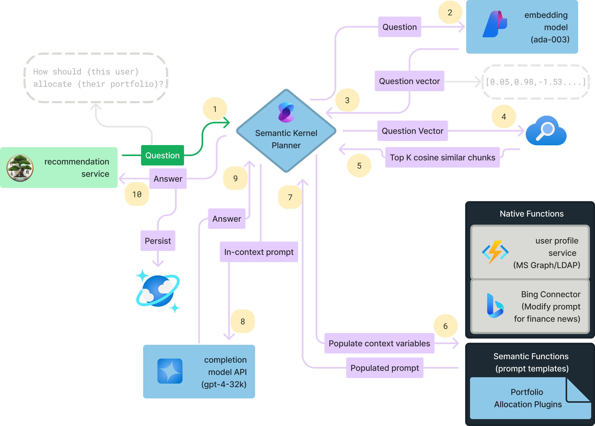

# Integrating Synthesized Insights in your Applications

In this section, we delve into the process of synthesizing portfolio recommendations as actionable insights using Project Miyagi. The workflow for this is orchestrated by the Semantic Kernel, as illustrated below:



## Initializing the Kernel

Firstly, we initialize the Kernel following the method [outlined in Project Miyagi](https://github.com/Azure-Samples/miyagi/blob/main/dotnet/recommendation-service/Program.cs#L30-L59). 

=== "C#"

    ```csharp hl_lines="1-1 4 9 16" linenums="1"
    var kernel = Kernel.Builder
        .WithLogger(ConsoleLogger.Log)
        .Configure(c =>
        {
            c.AddAzureTextCompletionService(
                Env.Var("AZURE_OPENAI_SERVICE_ID"),
                Env.Var("AZURE_OPENAI_DEPLOYMENT_NAME"),
                Env.Var("AZURE_OPENAI_ENDPOINT"),
                Env.Var("AZURE_OPENAI_KEY"));
            c.AddAzureTextEmbeddingGenerationService(
                Env.Var("AZURE_OPENAI_EMBEDDINGS_SERVICE_ID"),
                Env.Var("AZURE_OPENAI_EMBEDDINGS_DEPLOYMENT_NAME"),
                Env.Var("AZURE_OPENAI_EMBEDDINGS_ENDPOINT"),
                Env.Var("AZURE_OPENAI_EMBEDDINGS_KEY"));
        })
        .WithMemoryStorage(new VolatileMemoryStore())
        .Configure(c => c.SetDefaultHttpRetryConfig(new HttpRetryConfig
        {
            MaxRetryCount = 2,
            UseExponentialBackoff = true
        }))
        .Build();
    ```
=== "Python"

    ```python hl_lines="4 7-8 11-12 16" linenums="1"
    import semantic_kernel as sk
    from semantic_kernel.connectors.ai.open_ai import AzureTextCompletion

    kernel = sk.Kernel()

    api_key, org_id = sk.openai_settings_from_dot_env()
    kernel.config.add_text_completion_service("dv",
                    OpenAITextCompletion("text-davinci-003",
                                            api_key,
                                            org_id))
    kernel.config.add_text_embedding_generation_service("ada",
                    OpenAITextEmbedding("text-embedding-ada-002",
                                            api_key,
                                            org_id))

    kernel.register_memory_store(memory_store=sk.memory.VolatileMemoryStore())
    ```
!!! note 
    We are utilizing both the Embeddings and Completion services as both models are integral to the process depicted above.

## Semantic Skills (prompts and prompt engineering)

After we initialize the Kernel, we can now begin to create the prompts that will be used to generate the synthesized insights. This can be more art than science, and we encourage you to experiment with different prompts and configurations to see what works best for your use case.

For the purposes of this workshop, we are envisioning a use case where you select a portfolio of stocks, and the system generates a summary of the portfolio, along with a recommendation on whether to buy, sell, or hold the portfolio.

=== "C#"

    ```csharp hl_lines="5 12" linenums="1"
    // ========= Import Advisor skill from local filesystem =========

        // You can also import this from Azure Blob Storage
        var skillsDirectory = Path.Combine(Directory.GetCurrentDirectory(), "Skills");
        var advisorSkill = _kernel.ImportSemanticSkillFromDirectory(skillsDirectory, "AdvisorSkill");
        
        // This will explained in full later in this section:
        var result = await _kernel.RunAsync(
            context,
            userProfileSkill["GetUserAge"],
            userProfileSkill["GetAnnualHouseholdIncome"],
            advisorSkill["InvestmentAdvise"]);
    ```
=== "Investment advise skill"

    ```json hl_lines="8 15-21" linenums="1"
     --8<-- "docs/assets/Skills/AdvisorSkill/InvestmentAdvise/skprompt.txt"
    +++++
    ```
=== "Configuration for advisor skill"

    ```json hl_lines="3 6-8" linenums="1"
    --8<-- "docs/assets/Skills/AdvisorSkill/InvestmentAdvise/config.json"
    +++++
    ```
??? tip "This is how you prompt engineer in your code"
    The snippets above highlight some of the primitives of SK that allow you to easily integrate `prompt engineering` in your existing workflows.


More coming soon...

[Sign up for updates](https://forms.office.com/r/rLds2s8RH1){ :target="_blank" .md-button .md-button--primary }